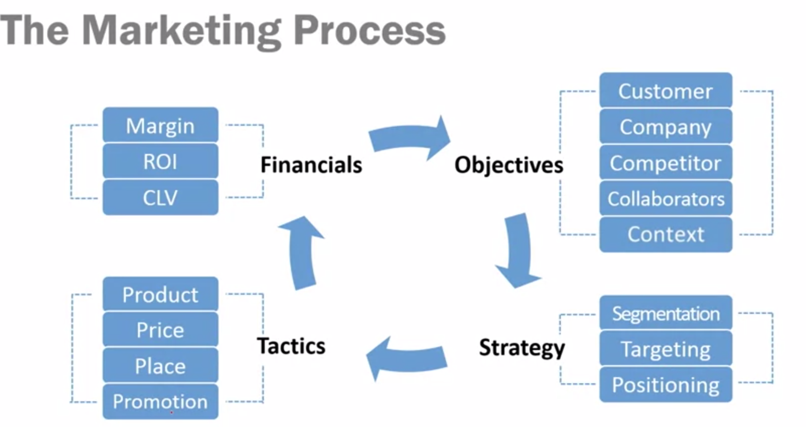
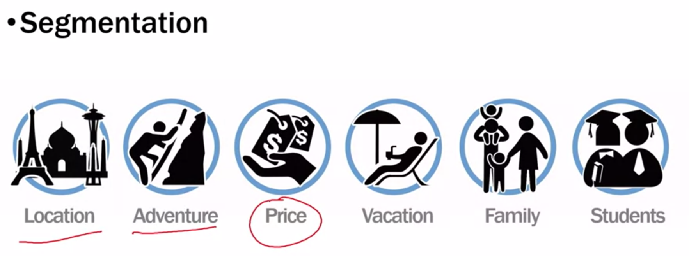
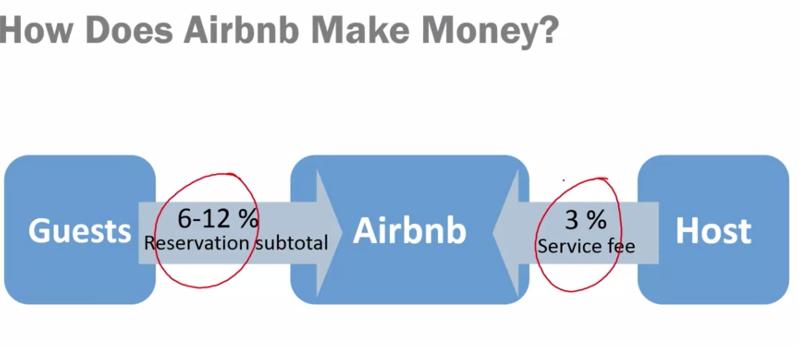

# Marketing Process

O processo de marketing possui passos que a maioria dos profissionais de marketing utiliza para o direcionamento do seu trabalho no dia-a-dia. É extremamente importante entender esse processo primeiro para só então começar a executar um trabalho de marketing analytics.

## O Processo

### Objetivo

O que você está tentando alcançar?

"I want to address a customer pain point using a new product."

#### AirBNB:

____COMO MELHORAR A EXPERIÊNCIA DO USUÁRIO?____

No AirBNB o cliente sou eu e você, todos que estão querendo viajar são clientes do AirBNB. A compania é o portal e dá a possibilidade de pesquisar e locais para passar as férias e hospdagem aconchegante e barata. Os competidores são os hóteis e companhias tradicionais. Os colaboradores do AirBNB também sou eu e você, visto que a empresa foca na economia compartilhada. O contexto de trabalho é a economia compartilhada.

### Estratégia

**A segmentação é a forma que você agrupa seus clientes de acordo com categorias diferentes.** A segmentação pode ser feita de várias maneira, porém no curso a segmentação é apresentada de forma diferente da que estou acostumado. Vindo de um background de machine learning segmentação é, para mim, um método onde deixamos que o próprio algoritmo determine quais são as regras de segmentação e a influência humana nesse processo vem da escolha da quantidade de grupos e também das características que serão usadas.

**Targeting nos diz sobre qual segmento vamos focar!** Ou seja, após um trabalho de segmentação é importante definir um target claro para a execução do trabalho. 

**Positioning se refere a proposição de valor que sua empresa oferece.** A escolha de um segmento como target sofre uma influência forte da proposição de valor que a empresa quer oferecer para seus clientes. No caso do AirBNB oferecer uma casa longe de casa para famílias (proposição de valor -> segmentação -> target). **O objetivo do posicionamento também é distinguir seu produto dos outros no mercado.**

### Tática

4 Ps do marketing

**Produto se refere à aquilo que está sendo oferecido para o cliente e que gerará a proposição de valor**, no caso do AirBNB é o apartamento, preço aparece no próprio site ou anúncio do apartamento, localização também está no anúncio do local, promoção nesse caso são as avaliações de outros clientes e elas podem influenciar a decisão.

### Financeiro

Show me the money! Como o AirBNB faz dinheiro? Aqui analisamos margem, return on investment e também customer lifetime value.

